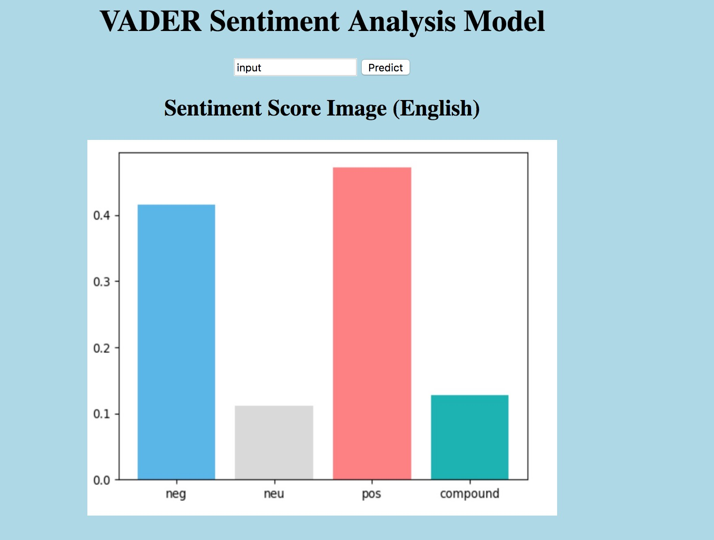

# ADS Project 5: Trade War -- Twitter Analysis

Term: Spring 2018

+ Group 1
+ Projec title: Trade War -- Twitter Analysis
+ Team members

	+ Cao, Xinlei xc2420@columbia.edu
	+ Chen, Mengqi mc4396@columbia.edu
	+ Li, Keran kl2993@columbia.edu
	+ Li, Xinrou(Presenter) xl2685@columbia.edu
	+ Tao, Wesley wt2271@columbia.edu
	
**Our main file can be found [here](doc/main.html).**
**Our website is [here](http://keran.pythonanywhere.com).**

**Online Vander Model Link is [here](http://keran.pythonanywhere.com/input).**


+ Project summary: This is our final Applied Data Science project. We fetched data from Twitter's API by Python with the key word, "Trade War", and built a website for it. We cleaned and organized original data, and saved as csv. First, we explored the data to find the opinions leaders based on the re-twitter counts. Secondly, we did some sentiment analysis by using Vader Machine Learning Model. Then, we visualized the proportions of positive, neutral, and negative attitudes with the corresponding timeline. Thirdly, we built a LDA Model for searching what topics are related to the positive opinions and negative opinions. Finally, we provided business insight about the relationship between the Dow Jones Industrial Average and the positive attitude change.
	
+ **Contribution statement**: 
    + Cao, Xinlei:Text data cleaning and preprocessing; Construct the VaderSentiment model for text sentiment analysis; Transform the text data into word vectors based on the Word2Vec technique; Construct the LSTM(Long Short Term Memory) sentiment analysis model based on tensorflow.
    + Chen, Mengqi: Descriptive analysis and background searching.
    + Li, Keran: Coded web scraping twitter api, scraped updated data, coded Flask web app, inserted machine learning model into webpage, wrote input.html, uploaded and integrated the Flask APP to pythonanywhwere, visulized top 20 sentiment score, wrote the main.html and integrated github file.
    + Li, Xinrou: Designed the website page; Wrote the website's HTML; Visualized the Dow Jones Index with positive attitude and the timeline; Wrote README.md.
    + Tao, Wesley: Helped to scrap data, cleaned all the twitter data, visulized opinion leader using d3 visulization, coded lda model and found insights based on topic models.

Following [suggestions](http://nicercode.github.io/blog/2013-04-05-projects/) by [RICH FITZJOHN](http://nicercode.github.io/about/#Team) (@richfitz). This folder is orgarnized as follows.

+ **Reference**: 

	+ [W3-HTML](https://www.w3schools.com/html/default.asp)
	+ [Vader Sentiment](https://github.com/cjhutto/vaderSentiment)
	+ [LSTM Sentiment Analysis](https://github.com/adeshpande3/LSTM-Sentiment-Analysis)
	+ [Sentiment Analysis with Lstms Using Tensorflow]( https://www.oreilly.com/learning/perform-sentiment-analysis-with-lstms-using-tensorflow)
	+ [Measuring Influence on Twitter](http://www.l2f.inesc-id.pt/~fmmb/wiki/uploads/Work/misnis.ref07.pdf)
```
proj/
├── lib/
├── data/
├── doc/
├── figs/
└── output/
```

Please see each subfolder for a README file.
